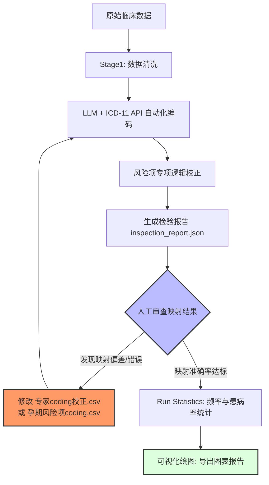

# gastational-icd11-diagnosis-mapping

本项目是一套完整的临床数据处理方案。通过**清洗 -> LLM自动化编码 -> 专家规则校正 -> 统计分析 -> 可视化**的流程，将原始临床描述（手术适应症、风险项、合并症）转化为标准的 ICD-11 编码。

## 1. 核心配置文件（可自定义修改）

项目依赖两份关键的 CSV 映射表，用户**必须**根据实际业务需求或临床金标准对其进行审查和修改：

1.  **`专家coding校正.csv`**
    *   **用途**：用于干预 LLM 的判断。当 LLM 映射不准或需要强制对齐特定术语时使用。
    *   **格式**：第一列为“原始临床术语”，第二列为“标准 ICD-11 编码”。
    *   **自定义建议**：定期查看 `inspection_report.json`，将映射错误的项加入此表进行强制修正。

2.  **`孕期风险项coding.csv`**
    *   **用途**：针对“孕期风险项”列的专项映射表。
    *   **格式**：第一列为“风险项目名称”，第二列为“对应编码”。
    *   **自定义建议**：此表决定了风险项的编码质量，修改后运行 `map_risk_item_icd11.py` 即可生效。

---

## 2. 统计控制参数详解 (`run_statistics.py`)

在执行统计分析时，可以通过脚本内部的三个布尔开关（Switch）来调整报告的粒度：

| 参数 | 类型 | 说明 |
| :--- | :--- | :--- |
| `ENABLE_GROUP_STATS` | bool | **大类合并开关**。若设为 `True`，脚本将根据 `GROUP_RULES` 预设，把如 JA20-JA25 的编码合并统计为“妊娠期高血压疾病”。 |
| `KEEP_INDIVIDUAL_STATS` | bool | **明细保留开关**。若设为 `True`，统计报告中会保留每一个具体的 ICD-11 原始编码（如 JA24.z）。 |
| `ONLY_KEEP_UNGROUPED_INDIVIDUALS` | bool | **互斥模式开关**。当开启大类统计时，若此项为 `True`，则属于大类的编码不再单独出现，只统计不属于任何大类的“孤立编码”。 |

*   **推荐配置**：若需全量报告，建议设为 `True / True / False`。

---

## 3. 环境与依赖

1.  **Python 库**：`pandas`, `polars`, `requests`, `openai`, `tqdm`, `matplotlib`, `openpyxl`。
2.  **ICD-11 API**：需按照 [WHO 官方文档](https://icd.who.int/docs/icd-api/ICDAPI-LocalDeployment/) 部署本地服务（默认地址：`http://localhost:8382`）。
3.  **LLM Key**：在环境变量中设置 `ARK_API_KEY`（火山方舟引擎）。

---

## 4. 运行流程

### 步骤 1：数据预清洗
```bash
python stage1_clean_20250805.py 原始文件.csv 清洗后文件.csv
```
*清理临床描述中的序号、冗余前缀（如“妊娠合并”）、无意义符号等。*

### 步骤 2：LLM 自动化映射
```bash
python llm_mapping_icd11_data_v7.py
```
*利用大模型进行语义拆解与翻译，并调用本地 ICD-11 API 锁定编码。该脚本支持断点续传（`temp_cache`）。*

### 步骤 3：风险项专项映射与逻辑校验
```bash
python map_risk_item_icd11.py
```
*根据 `孕期风险项coding.csv` 映射，并执行交叉列逻辑检查（如：根据手术适应症内容排除特定风险编码，避免误诊）。*

### 步骤 4：生成检验报告
```bash
python run_inspection.py
```
*输出 `inspection_report.json`。**重点步骤**：打开此文件，检查同一个 ICD 编码下是否混入了错误的原始术语。*

### 步骤 5：执行统计与绘图
```bash
python run_statistics.py
python 绘图.py -i 统计报告.csv
```

---

## 5. 编码迭代优化流程图 (Mermaid)

编码工作并非一次性完成，而是一个不断通过“专家规则”修正“模型判断”的迭代过程：



---

## 6. 注意事项
*   **数据安全**：使用本地部署的 ICD-11 API 可确保患者敏感诊断信息不外流。
*   **性能**：映射脚本采用了多线程并行处理，并发数可在 `MAX_WORKERS` 中调整。
*   **字体**：绘图脚本若在 Linux 下运行，需确保系统安装了 `SimHei` 或其他支持中文的字体。